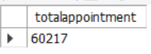
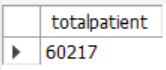
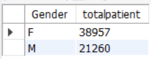
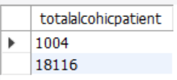
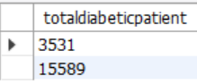
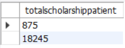
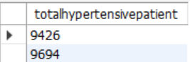
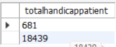

# HealthCare Project
## Introduction
This project entails 106,988 records of healthcare datasets. It contains patients medical appointments and whether they showed up or not
alongside with strength and weakness over a long period of time
## Variables
Gender, Age ---demographics  

ScheduledDay, AppointmentDay, DateDiff  ---- scheduling info (time between booking & appointment)  

Scholarship, Hypertension, Diabetes, Alcoholism, Handicap  ---- health & social conditions  

SMSReceived ----- reminder message indicator  

Showed_up ----- target variable (whether the patient attended the appointment)  

## Business Question
Possible Business Questions This Dataset Can Answer:
## Attendance Prediction
What factors influence whether patients show up for their appointments?
## Demographic Analysis
Do age or gender groups have different attendance rates
Are younger or older patients more likely to miss appointments
## Health Condition Insights
Do patients with chronic conditions hypertension, diabetes, etc have higher or lower attendance?
Does having multiple conditions affect likelihood of showing up

## Total Patient and Appointment
the total number of patient that booked appointment their health medical check up amount to 60217

## Total patient based on gender
the total number of female patient is greater than the male patient

## Total patient based on acholic patient
the total number of alcoholic patient is lesser than non-alcoholic patient

## Total patient based on diabetic patient
the total number of diabetic patient is leser than non-diabetic patient

## Total patient based on scholarship patient
the total number of scholarship patient is lesser than scholarship patient

## Total patient based on hypertensive patient
the total number of hypertensive patient is lesser than nonhypertensive patient 

## Total patient based on handicap patient 
the total number of handicap patient is lesser than non handicap patient 

## Technology Used 
this is sql project. a single query technique was used to run the query coupled with aggregate function which was then used 
to aggregate large rows of dat into a small rows of data given the information we need
